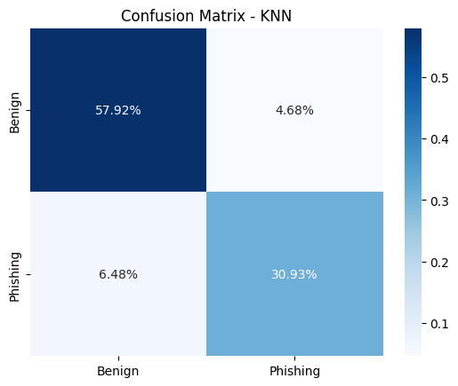

### LR
```
              precision    recall  f1-score   support

      Benign       0.92      0.93      0.93      2542
    Phishing       0.89      0.87      0.88      1519

    accuracy                           0.91      4061
   macro avg       0.90      0.90      0.90      4061
weighted avg       0.91      0.91      0.91      4061
```

<p align="center">
    
</p>

### KNN
```
              precision    recall  f1-score   support

      Benign       0.90      0.93      0.91      2542
    Phishing       0.87      0.83      0.85      1519

    accuracy                           0.89      4061
   macro avg       0.88      0.88      0.88      4061
weighted avg       0.89      0.89      0.89      4061
```

<p align="center">
    
</p>

### RFC
```
              precision    recall  f1-score   support

      Benign       0.95      0.96      0.95      2542
    Phishing       0.93      0.92      0.92      1519

    accuracy                           0.94      4061
   macro avg       0.94      0.94      0.94      4061
weighted avg       0.94      0.94      0.94      4061
```

<p align="center">
    
</p>

### MLP
```
              precision    recall  f1-score   support

      Benign       0.94      0.97      0.95      2542
    Phishing       0.95      0.89      0.92      1519

    accuracy                           0.94      4061
   macro avg       0.94      0.93      0.94      4061
weighted avg       0.94      0.94      0.94      4061
```
<p align="center">
    
</p>