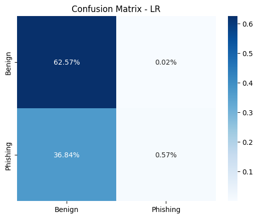
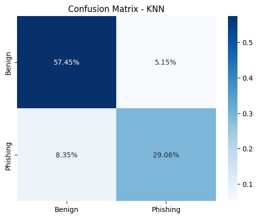
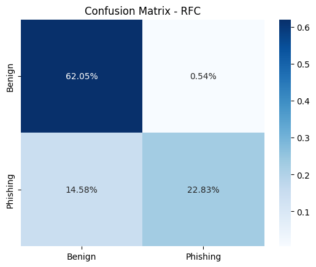
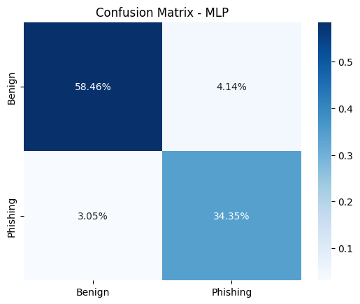

### LR
```
              precision    recall  f1-score   support

      Benign       0.63      1.00      0.77      2542
    Phishing       0.96      0.02      0.03      1519

    accuracy                           0.63      4061
   macro avg       0.79      0.51      0.40      4061
weighted avg       0.75      0.63      0.49      4061
```

<p align="center">
    
</p>

### KNN
```
              precision    recall  f1-score   support

      Benign       0.87      0.92      0.89      2542
    Phishing       0.85      0.78      0.81      1519

    accuracy                           0.87      4061
   macro avg       0.86      0.85      0.85      4061
weighted avg       0.86      0.87      0.86      4061
```

<p align="center">
    
</p>

### RFC
```
              precision    recall  f1-score   support

      Benign       0.81      0.99      0.89      2542
    Phishing       0.98      0.61      0.75      1519

    accuracy                           0.85      4061
   macro avg       0.89      0.80      0.82      4061
weighted avg       0.87      0.85      0.84      4061
```

<p align="center">
    
</p>

### MLP
```
              precision    recall  f1-score   support

      Benign       0.95      0.93      0.94      2542
    Phishing       0.89      0.92      0.91      1519

    accuracy                           0.93      4061
   macro avg       0.92      0.93      0.92      4061
weighted avg       0.93      0.93      0.93      4061
```

<p align="center">
    
</p>

