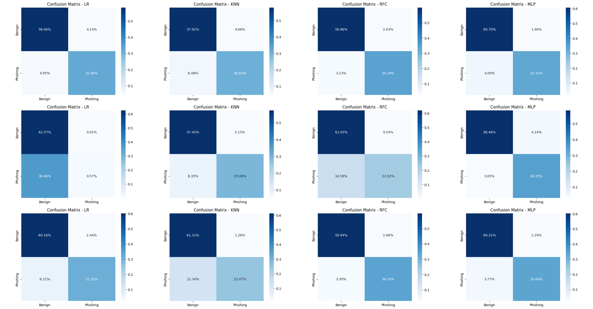
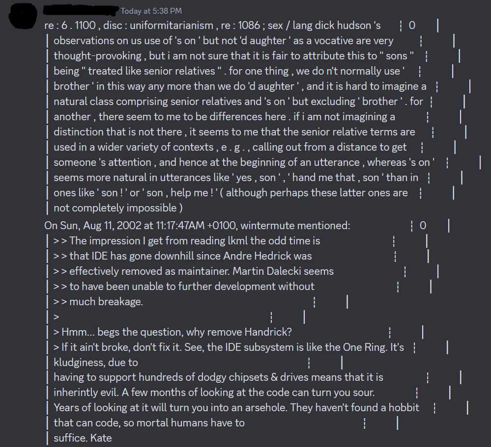
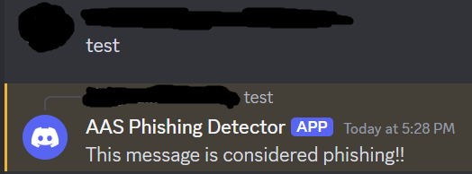

# Phishing Message Detector
As the name implies, the objective is to develop a ML model capable of detecting phishing messages. The model uses only pure text for training (no URLs or any special kind of text).

We use the model, alongside another ML model, that detects phishing URLs, made by our collegue Rafael Pinto, to detect phishing messages and URLs on discord servers. For that, we developed a [discord bot](https://github.com/pompeucosta/AAS_Discord_Bot).

This project was developed as part of a university project.

## Authors
This model was developed and trained by Pompeu Costa and João Mourão.

## Training
To train the model, we used this [dataset from huggingface](https://huggingface.co/datasets/David-Egea/phishing-texts).
Dataset credits go to its author.

### Pre-Processing
Our pre-processing consists of two steps: data pre-processing and feature extraction.

To pre-process, we just take each row of the dataset, transform it into tokens, apply lemmatization and remove stop words.
We then join the pre-processed tokens again to form the pre-processed rows.

For feature extraction, we experimented three different methods: `Bag of Words`, `Fast Text` and `TF-IDF`.
In all of the methods, we decided to use a maximum of 512 features.

The results can be seen in their respective md file: [BoW](./BoWResults.md), [Fast Text](./FastTextResults.md) and [TF-IDF](./TFIDFResults.md).
The parameters used for each classifier are described in the next section.

To facilitate the viewing of the results, the image below contains the results of each feature extraction method.
The columns represent the classifier and the rows represent the method (BoW -> Fast Text -> TF-IDF).




### Classifiers
After pre-processing, the model needs to be trained. For that, we experimented with four classifiers: `Logistic Regression`, `K Nearest Neighbours`, `Random Forest` and `Multi-Layer Perceptron`.

To assess the best parameters for each classifier, we performed a `Grid Search` for the following parameters:
```python
params = {
    'LR': {
        'C': [0.01, 0.1, 1, 10],
        'solver': ['lbfgs', 'liblinear','saga','sag'],
        'max_iter': [100, 200, 300]
    },
    'KNN': {
        'n_neighbors': [3, 5, 7, 10],
        'weights': ['uniform', 'distance'],
        'metric': ['euclidean', 'manhattan']
    },
    'RFC': {
        'n_estimators': [50, 100, 150, 200],
        'max_depth': [None, 10, 20, 30],
        'min_samples_split': [2, 5, 10],
        'min_samples_leaf': [1, 2, 4]
    },
    'MLP': {
        'hidden_layer_sizes': [(1,),(100, 100),(128,64,32), (256,128,64)],
        'activation': ['relu', 'tanh', 'identity', 'logistic'],
        'solver': ['adam', 'sgd', 'lbfgs'],
        'learning_rate_init': [0.001, 0.01],
    }
}
```

The best parameters for each classifier were the following:

- LR: {'C': 0.1, 'max_iter': 100, 'solver': 'lbfgs'}
- KNN: {'metric': 'euclidean', 'n_neighbors': 5, 'weights': 'distance'}
- RFC: {'max_depth': None, 'min_samples_leaf': 1, 'min_samples_split': 10, 'n_estimators': 200}
- MLP: {'activation': 'relu', 'hidden_layer_sizes': (256, 128, 64), 'learning_rate_init': 0.001,'solver': 'adam'}

> [!NOTE]
> For our sake, we only ran the search once, which means that we could only experiment the results with one of the feature extraction methods.
> We used `Bag of Words`.

## Results
Looking at the compilation image, its possible to see that the best one is the `Multi-Layer Perceptron` classifier with the `Fast Text` method.
It keeps a good accuracy while having a low rate of false positives.

> [!NOTE]
> Having a benign message that is considered phishing will not cause any harm, however, having a phishing message that is considered benign can cause harm to the users.
> Thus, we decided to sacrifice a bit of accuracy in favor of lower false positive rates.

### Running the model in the discord bot
The bot, using this model, was capable of identifying phishing messages.


It also successfully identified benign messages (the bot doesn't reply to the message when it is considered benign).



However, it's not perfect. It considered some benign messages as phishing messages.





We suspect that it's due to the `Fast Text` model not being trained well enough.

Nevertheless, the model and the bot worked as intended.
Albeit not perfect, it detects phishing messages.
